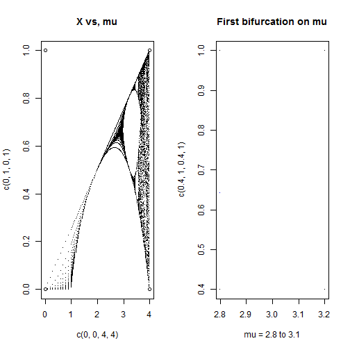

Econometric "Shocks" Generated from Smooth Parameter Changes
======================================================== 
author: Schwarzbek
date: Fri Feb 20 07:47:28 2015 

Simple things create complex behaviors
============================

Sudden changes in time series are labeled 'shocks' -  
 Much effort is expended, often __wasted__ to correlate with events 

 - [Granger Causality](http://en.wikipedia.org/wiki/Granger_causality) and active research (good use, see reference) 

 - Most stock market "analyses" _i.e. "stocks rose on falling oil prices"_ compared with _"stocks fell on falling oil prices"_ (not so good) 

 - Practically any multivariate time-series analysis that claims unexpected results. ("you decide") 
 
##### Guangzhong Li, James F. Refalo, Lifan Wu, “Causality-in-variance and causality-in mean among European government bond markets,” Applied Financial Economics DOI:10.1080/09603100701735953 

A Simple Population Model
=========================================
 
Guckenheimer & Holmes, “Nonlinear Oscillations, Dynamical Systems, and Bifurcations of Vector Fields,” Springer Mathematics, Volume 42 
***

A simple series, $$x_1 = \mu x_0 ( x_0 + 1 )$$ has a range for $\mu$ where the value bounces between two values forever 

We concatenate these with some induced noise to develop a simple two level model

++++  
Kuehn, A mathematical framework for critical transitions: Bifurcations, fast–slow systems and stochastic dynamics,” Physica D  doi:10.1016/j.physd.2011.02.0122011  

A Feel for the Function
====
The [interactive](http://www.github.com/xwarzbek/) version will help develop a feel for how small changes can look like important moves.   


```r
eps <- jitter(rep(0,maxtime), 1)
genTimeSeries <- function(maxtime, mu, np, eps) {
  tseries <- matrix(ncol=3, nrow=maxtime )
  colnames(tseries) <- c("u", "v", "t")
   x0 <- 0.5  
  for ( i in 1:maxtime) {
    x1 <- mu * x0 * (1 - x0) + np * eps[i]
    x2 <- mu * x1 * (1 - x1) - np * eps[i]
    tseries[i,] <- cbind(x1, x0, i)
    x0 <- x2
  }
 as.data.frame(tseries[-c(1:100),])
}
```


Exercises
===
With this really simple system, and a bit of practice, you might be able to anticipate when a transition is imminent with just a little nudge of $\mu$

The effect, technically, is that "the variance then Granger causes a shock." While nonsensical physically, it can be used as an alert in real time.

References
Scheffer et al., “Anticipating Critical Transitions,” Science, DOI:10.26/science.111225244  
 
George Sugihara et al. “Detecting Causality in Complex Ecosystems,” Science , DOI: 10.1126/science.1227079 
